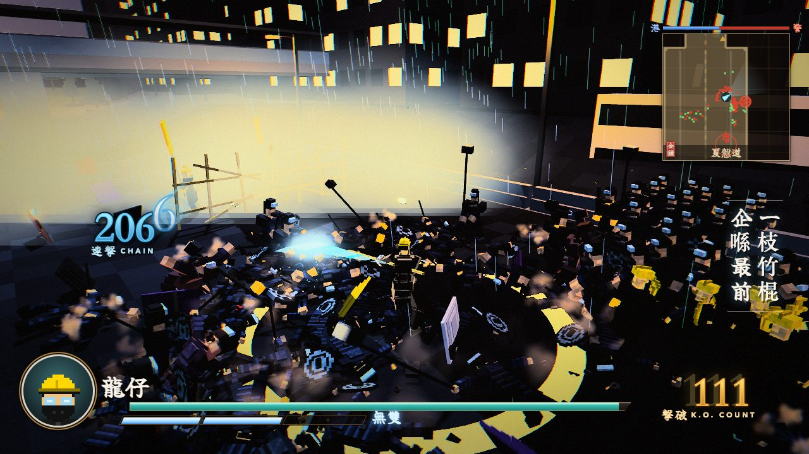
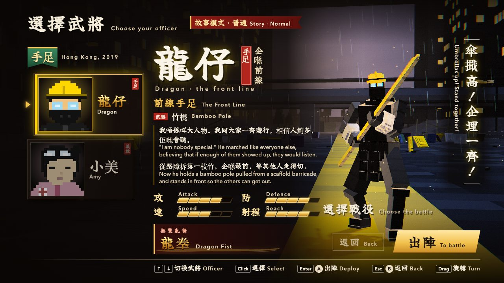
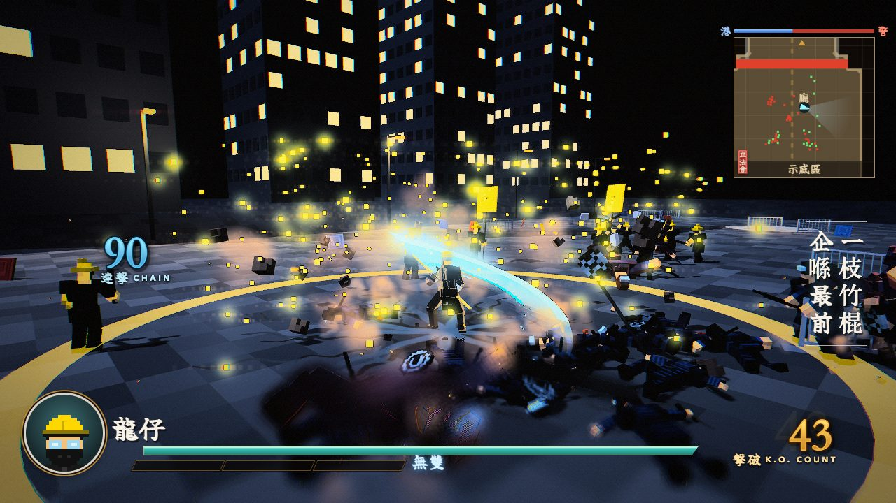
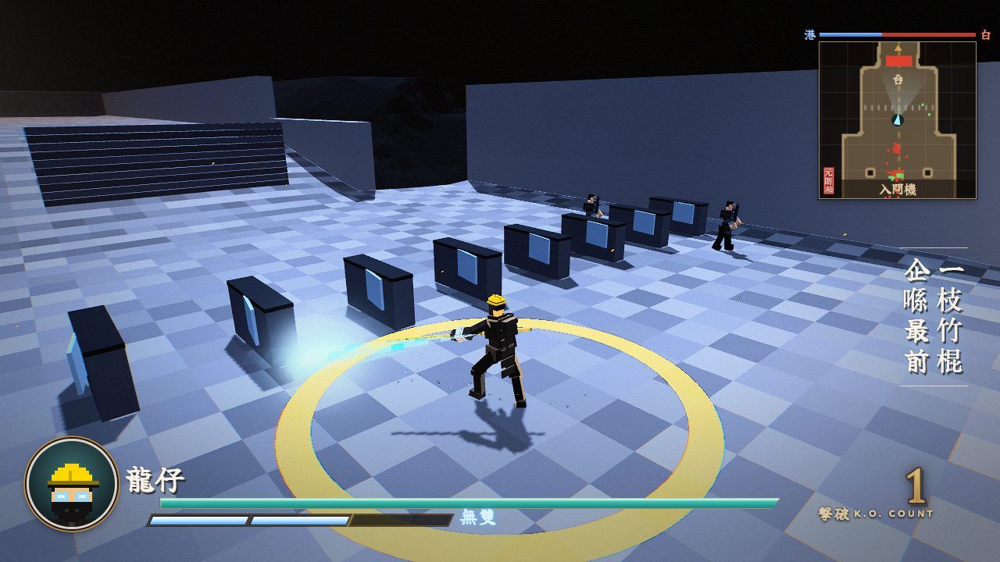
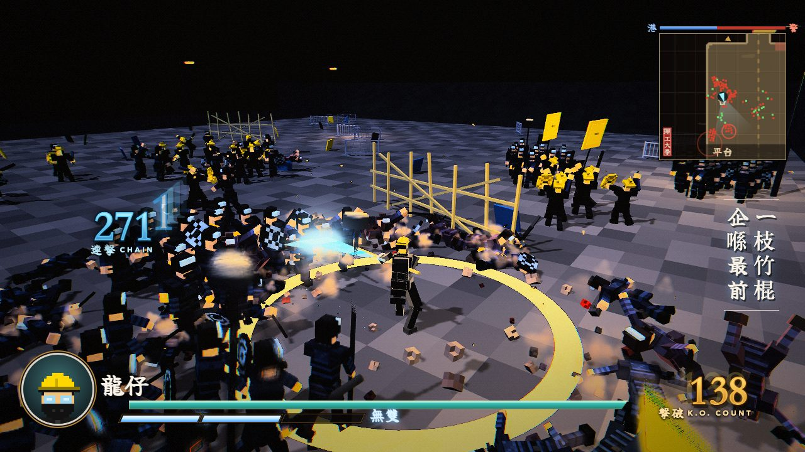
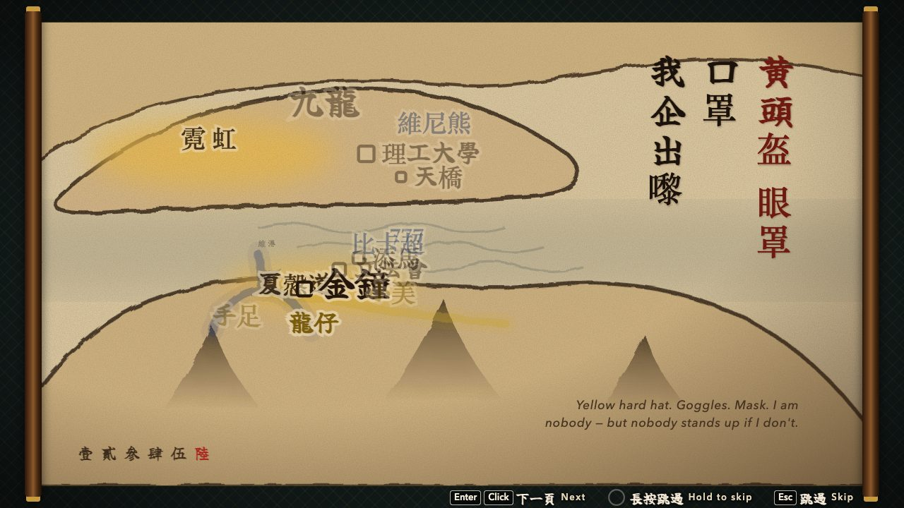
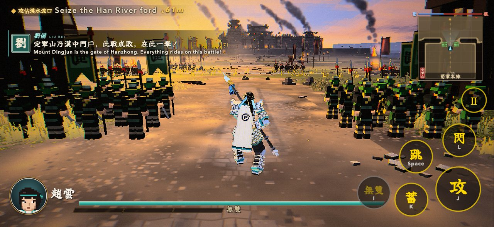

# 香港自由戰士 HK Freedom Fighter · Voxel

<p align="center"><a href="https://hk-freedom-voxel.vercel.app"></a></p>

<p align="center"><b><a href="https://hk-freedom-voxel.vercel.app">▶ Play in your browser — hk-freedom-voxel.vercel.app</a></b> · desktop or phone (landscape)</p>

| | |
| --- | --- |
|  |  |
| 龍仔 Dragon (bamboo pole) or 小美 Amy (twin umbrellas) | Ch. II 立法會 — the plaza under searchlights |
|  |  |
| Ch. III 元朗 — the white shirts in the station | Ch. IV 理工大學 — the siege |
|  |  |
| Ink hand-scroll prologues on a map of 香港 | Touch controls on a phone |

A 3D voxel rebuild of the Phaser beat 'em up [香港自由戰士](https://hk-freedom-fighter.vercel.app). Hong Kong, June –
November 2019: real places, fictional heroes. The protesters are the heroes; the ending is hopeful and true to the
record — ropes, sewers and motorbikes waiting in the dark — and remembers the people who stood.

- **Fighters** — 龍仔 Dragon (竹棍 bamboo pole from a scaffold barricade: sweeps, vaulting kicks; Musou 龍拳 Dragon
  Fist) and 小美 Amy (雙傘 two folding umbrellas, jabbing closed and bashing open; Musou 旋風腿 Hurricane Kick). The
  other one joins the dialogue.
- **Chapters** — 第一章 金鐘 Admiralty (hold the umbrella line through the tear gas, cover the stretchers, 777 The
  Rubber Stamp) · 第二章 立法會 LegCo (break the glass wall, 比卡超 The Shocker, carry the four out before the
  clearance) · 第三章 元朗 Yuen Long (escort the passengers, hold the train doors, 強哥 The Fixer) · 第四章 理工大學
  PolyU (the water cannon, the rope route, 維尼熊 The Bear in four phases) — then the ending scroll 天光 and a tribute
  card. After each chapter, the Phaser game's history text for that day.
- **烽火戰 Bonfire battle** (title menu) — any of the five battlefields against the clock: K.O. 1000 in 5:00. Before
  each battle 1–2 **烽火事件牌** event cards are drawn from the battle seed — 32 fictionalised cards inspired by recent
  Asian news (人鏈, 雨傘陣, 斷網, 宵禁令, 八號風球, 黑色暴雨 …), each a buff, a debuff or a twist on attack, defence,
  speed, the Musou gauge, enemy waves and officers, allies, the clock or the minimap. 再戰 keeps the hand, 再燃烽火
  draws a new one. Cards and rules: `src/fenghuo/`; oracle: `bench/fenghuo/balance.mjs`.
- Written Cantonese + English throughout. Plays on phones: floating stick, 攻 蓄 跳 閃 無雙 buttons, a lighter mobile
  quality tier.

No real person is depicted: the bosses are original archetypes under the Phaser game's nicknames; no real flags,
badges or insignia appear on any model.

Plain ES modules, Three.js r186 vendored, deterministic fixed 60 Hz simulation, no build step. Built on
[icomppower/sheep-village](https://github.com/icomppower/sheep-village)'s engine hooks (scroll player, dual-wield rig,
crowd skins, officer models, bot), itself a reskin of [mike007jd/voxel-musou](https://github.com/mike007jd/voxel-musou).
Upstream's 定軍山 chapter stays in the repo behind `?dev` as the determinism gate.

## Run

ES modules don't load from `file://`, so serve the folder with any static server:

```sh
python3 -m http.server 8000
```

Then open http://localhost:8000 . Needs a WebGL2 browser. `?hq` forces full quality on a phone; `?dev` shows the
upstream 定軍山 chapter and officers. `?go=fenghuo&char=lungjai&ch=hk1&seed=42` jumps straight into a
烽火戰 with that seed's cards.

## Controls

| Action | Keys | Gamepad | Touch |
| --- | --- | --- | --- |
| Move (camera-relative) | WASD / arrow keys | left stick | floating stick (left half) |
| Attack | J / left click | X □ | 攻 |
| Charge | K / right click (mid-combo) | Y △ | 蓄 |
| Jump | Space | A × | 跳 |
| Dodge | L / Shift | R1 R2 | 閃 |
| Musou (gauge full) | I | B ○ | 無雙 (lit when ready) |
| Camera | mouse (click the field to lock it) / Q E | right stick | drag on the right half |
| Recenter / face nearest officer | R | L1 L2 | — |
| Pause | Esc | | Ⅱ |

## Tests

`sh bench/verify.sh` runs every gate: upstream Chapter I state hashes (Node + headless Chrome), rig and dual-wield
probes, character and boss gates for both fighters, map gates and a bot that must win every chapter with both fighters
in three play styles, scroll and result-card checks, the touch hook (touch and keyboard produce identical input logs and
state hashes; every button hit-testable at 844×390; a tap-through from boot to a battle on a phone), the ending flow,
and frame time on desktop and on an emulated phone with a 4× CPU throttle. `--quick` skips the Chrome half. Build log:
`PROGRESS.md`; screenshots per stage: `bench/shots/`.

`node --import ./bench/harness/register.mjs bench/fenghuo/balance.mjs` runs the 烽火 gates (deck bounds and types, the
draw, determinism, render-only cards, card direction on the bot's K.O. pace, every draw winnable);
`node bench/fenghuo/shots.mjs` walks title → 烽火戰 → result in headless Chromium and saves screenshots.

## Credits & License

- Engine and original game: [mike007jd/voxel-musou](https://github.com/mike007jd/voxel-musou) by BubuAi — MIT, see
  [LICENSE](LICENSE). Engine hooks from [icomppower/sheep-village](https://github.com/icomppower/sheep-village) (MIT).
  The HK Freedom Fighter content is added on top under the same license.
- The original 2D game: [香港自由戰士 (Phaser)](https://hk-freedom-fighter.vercel.app) — the cast, the boss phases and
  lines, the 龍仔 prelude and the four history texts come from it.
- [three.js](https://threejs.org/) r186 — MIT.
- Fallback brush font `src/ui/brush.woff2`: a subset of Yuji Boku by Kinuta Font Factory, SIL Open Font License 1.1.
  macOS system fonts (Xingkai SC, Kaiti SC) are used when present.

All characters are fictional; places and dates are real. Fan project, not affiliated with or endorsed by KOEI TECMO; no
assets from any commercial game are included.
