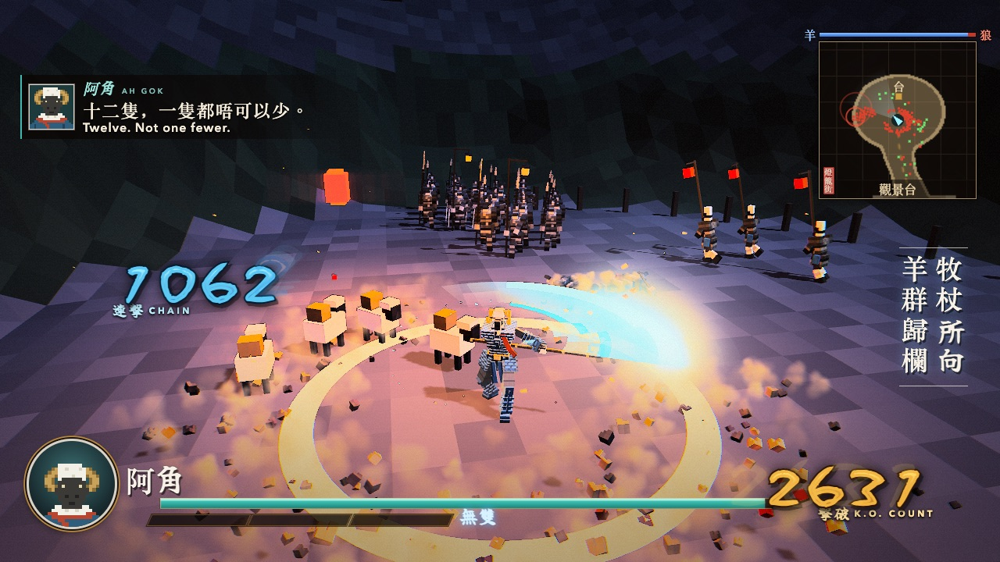
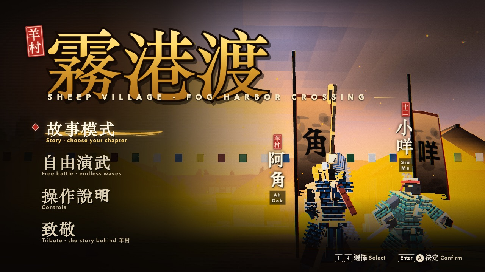
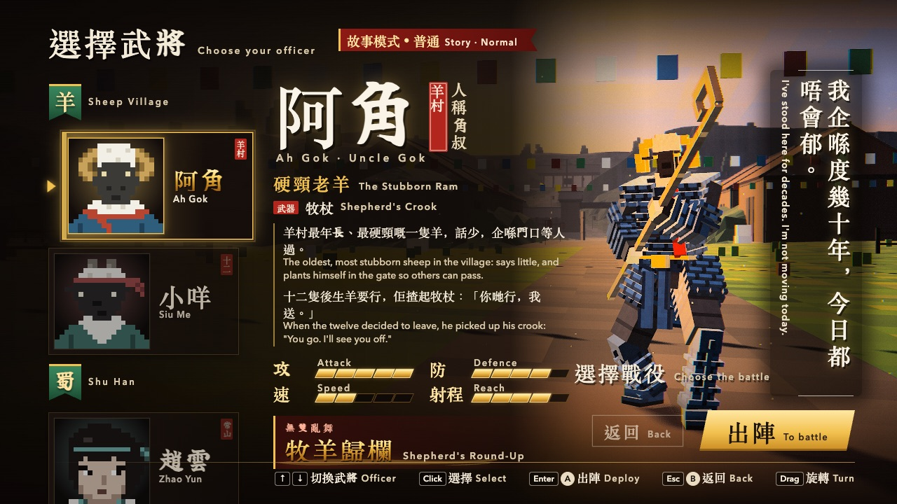
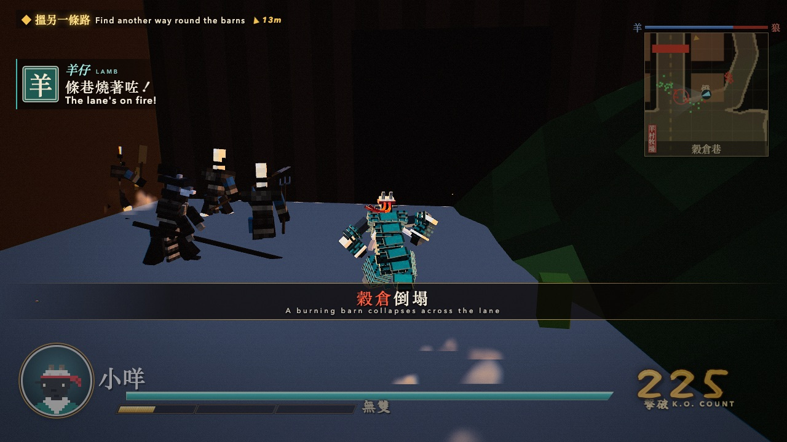
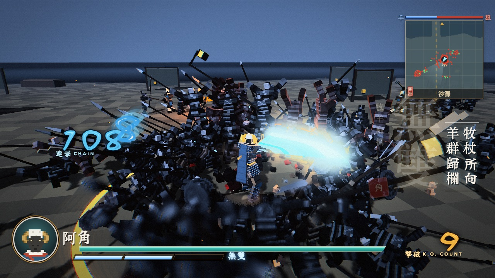
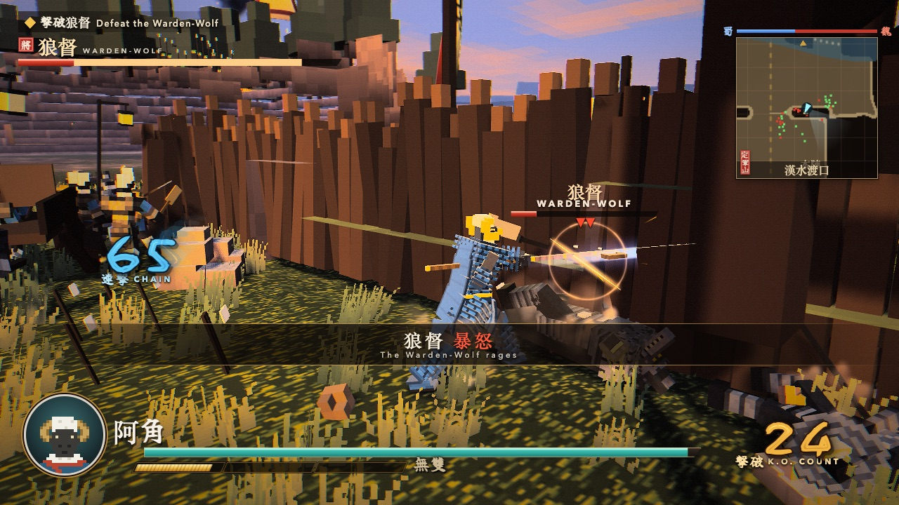
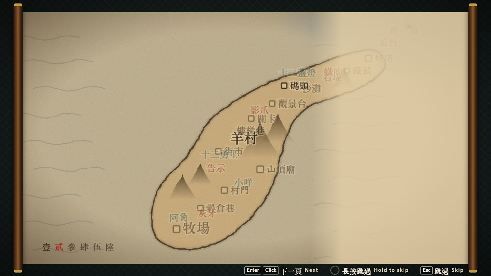

# 羊村 · 霧港渡 — Sheep Village: Fog Harbor Crossing

<p align="center"><a href="https://icomppower.github.io/sheep-village/"></a></p>

<p align="center"><b><a href="https://icomppower.github.io/sheep-village/">▶ Play in your browser — icomppower.github.io/sheep-village</a></b></p>

| | |
| --- | --- |
|  |  |
| Title — 羊村 seal | Pick 阿角 (crook) or 小咩 (twin shears) |
|  |  |
| Ch. I 羊村牧場 — the pasture | Ch. III 霧港 — Musou 牧羊歸欄 on the beach |
|  |  |
| 狼督 the Warden, final duel | Hand-scroll prologue |

A browser-playable voxel crowd-battler. The wolves have taken the lambs across the fog harbor; the villagers of
羊村 go and bring every one of them home. Three chapters, two playable sheep, four wolf officers, a happy ending.

A reskin of [Voxel Musou](https://github.com/mike007jd/voxel-musou) on its unchanged engine: plain ES modules,
Three.js r186 vendored, deterministic fixed 60 Hz simulation, no build step.

## What's in it

- **Officers** — 阿角 Ah Gok (shepherd's crook: sweeps, hooks, Musou 牧羊歸欄 *Shepherd's Round-Up*) and 小咩 Siu Me
  (twin shears, dual-wield: tornado charge, Musou 千剪飛花 *Thousand Snips*). The other one joins the dialogue.
- **Story** — 第一章 羊村牧場 the pasture raid · 第二章 燈籠街夜行 Lantern Street by night · 第三章 霧港 the Fog
  Harbor, each opened by an ink hand-scroll and closed with a seal stamp; the ending scroll brings all twelve home.
- **Wolves** — grey-kit grunts, officers 灰牙 Grey Fang, 影爪 Shadow Claw, 鐵吻 Iron Muzzle and 狼督 the Warden
  (three-phase boss). Plain grey kit, no flags or insignia.
- Upstream's Chapter 「定軍山」 and free battle are still in the menu.
- **Tribute** (致敬, title menu) — a card on the real events the books grew from (below).

## Run

ES modules don't load from `file://`, so serve the folder with any static server:

```sh
python3 -m http.server 8000
```

Then open http://localhost:8000 . Needs a WebGL2 browser; a desktop GPU is recommended.

## Controls

Keyboard and mouse, or a gamepad.

| Action | Keys | Gamepad |
| --- | --- | --- |
| Move (camera-relative) | WASD / arrow keys | left stick |
| Attack | J / left click | X □ |
| Charge | K / right click (mid-combo) | Y △ |
| Jump | Space | A × |
| Dodge | L / Shift | R1 R2 |
| Musou (gauge full) | I | B ○ |
| Camera | mouse (click the field to lock it) / Q E | right stick |
| Recenter / face nearest officer | R | L1 L2 |
| Pause / controls | Esc | |

## Tests

`sh bench/verify.sh` runs every gate: upstream Chapter I state hashes (Node + headless Chrome), rig and dual-wield
probes, character and boss gates, map gates and a bot that must win every chapter with both officers in three play
styles, crowd-skin and scroll pixel hashes, and frame time at 300 / 600 wolves. `--quick` skips the Chrome half.
Build log: `PROGRESS.md`.

## Credits & License

- Engine and original game: [mike007jd/voxel-musou](https://github.com/mike007jd/voxel-musou) by BubuAi — MIT, see
  [LICENSE](LICENSE). The Sheep Village content is added on top under the same license.
- [three.js](https://threejs.org/) r186 — MIT.
- Fallback brush font `src/ui/brush.woff2`: a subset of Yuji Boku by Kinuta Font Factory, SIL Open Font License 1.1.
  macOS system fonts (Xingkai SC, Kaiti SC) are used when present.
- Inspiration: the *Sheep Village* (羊村) picture books and the "Twelve Warriors of Sheep Village" story, as recorded by
  the [China Unofficial Archives (#3429)](https://minjian-danganguan.org/archive/3429). Only the premise inspired this
  game; no text or art from the books is used, and all characters and designs here are original.

Fan project, not affiliated with or endorsed by KOEI TECMO or the books' authors. "Dynasty Warriors" is a trademark of
KOEI TECMO. No assets from any commercial game are included.
